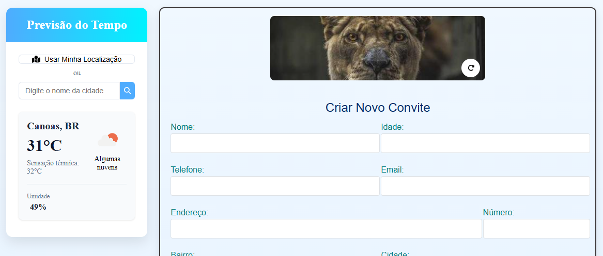

# SimfreteInvitationAndWeather

Aplicação Angular que exibe informações meteorológicas em tempo real usando a API do OpenWeatherMap e Gerando um convite  

Você pode acessar a aplicação hospedada no Vercel através do seguinte link:

[weather and invitation <- ](https://simfrete-invitation-and-weather.vercel.app/)



## 🚀 Começando

### Pré-requisitos

- Node.js (versão 14 ou superior)
- NPM (Node Package Manager)
- Angular CLI versão 19.2.4

### Instalação

1. Clone o repositório:
```bash
git clone git@github.com:DouglasB834/simfrete-invitation-and-weather.git
```

2. Instale as dependências:
```bash
npm install
```

3. Start Project:
```bash
npm run start
```

4. Acesse `http://localhost:4200` no seu navegador

## 🔑 Configuração das Chaves de API

### OpenWeatherMap API Key

1. Acesse [OpenWeatherMap](https://home.openweathermap.org/api_keys) e crie uma conta gratuita
2. Gere sua chave de API
3. Configure a chave no arquivo `src/environments/environment.ts`:
```typescript
export const environment = {
  production: false,
  API_KEY: 'sua_chave_api_aqui',
  API_URL: 'https://api.openweathermap.org/data/2.5/weather'
};
```
### Observações Importantes
- A chave gratuita tem limite de 60 chamadas por minuto

## 🌤️ API OpenWeatherMap

### Rotas Principais

#### 1. Busca por Cidade
```typescript
GET https://api.openweathermap.org/data/2.5/weather?q={city}&appid={API_key}&units=metric&lang=pt_br
```
- Parâmetros:
  - `q`: Nome da cidade
  - `units`: metric (para Celsius)
  - `lang`: pt_br (para português do Brasil)

#### 2. Busca por Coordenadas
```typescript
GET https://api.openweathermap.org/data/2.5/weather?lat={lat}&lon={lon}&appid={API_key}&units=metric&lang=pt_br
```
- Parâmetros:
  - `lat`: Latitude
  - `lon`: Longitude
  - `units`: metric (para Celsius)
  - `lang`: pt_br (para português do Brasil)

### Dados Retornados

A API retorna informações como:
- Temperatura atual
- Sensação térmica
- Umidade
- Descrição do clima
- Ícone representativo

### Ícones do Clima
```typescript
GET https://openweathermap.org/img/wn/{icon_code}@2x.png
```
Códigos dos ícones disponíveis:
- `01d` - céu limpo (dia)
- `01n` - céu limpo (noite)
- `02d` - poucas nuvens (dia)
- `02n` - poucas nuvens (noite)
- `03d/n` - nuvens dispersas
- `04d/n` - nuvens quebradas
- `09d/n` - chuva
- `10d/n` - chuva (dia/noite)
- `11d/n` - tempestade
- `13d/n` - neve
- `50d/n` - névoa

### Previsão por Hora **nao implementado**
```http
GET https://api.openweathermap.org/data/2.5/forecast?q={city}&appid={API_key}&units=metric&lang=pt_br
```
Retorna previsão para 5 dias com intervalos de 3 horas, incluindo:
- Temperatura
- Sensação térmica
- Temperatura mínima e máxima
- Pressão
- Umidade
- Condições climáticas
- Velocidade do vento
- Visibilidade

### Exemplo de Resposta da API
```json
{
  "main": {
    "temp": 294.14,
    "feels_like": 293.99,
    "temp_min": 294.14,
    "temp_max": 294.14,
    "pressure": 1014,
    "humidity": 65
  },
  "weather": [
    {
      "description": "nuvens dispersas",
      "icon": "03d"
    }
  ]
}
```

### Parâmetros Comuns
- `units=metric` - temperatura em Celsius
- `lang=pt_br` - respostas em português
- `appid` - sua chave de API

### Observações
- Limite gratuito: 60 chamadas por minuto
- Dados atualizados a cada 10 minutos
- Ícones disponíveis em 2x (100x100px) e 4x (200x200px)


## 🛠️ Tecnologias Utilizadas

- Angular 19.2.0
- TypeScript 5.7.2
- RxJS 7.8.0
- Font Awesome para ícones
- OpenWeatherMap API

## 📦 Estrutura do Projeto

This project was generated using [Angular CLI](https://github.com/angular/angular-cli) version 19.2.4.


## 🎉 Mensagem Doug

Este é meu primeiro projeto em Angular! Foi desafiador, mas muito divertido também. Espero conseguir entender melhor algumas funções e, principalmente, como reaproveitar componentes com loops, assim como fazia em React com o método `map`. Aqui, estou aprendendo a usar `for` e a aproveitar melhor o TypeScript, que sinto que foi pouco utilizado até agora. Estou animado para continuar essa jornada!
